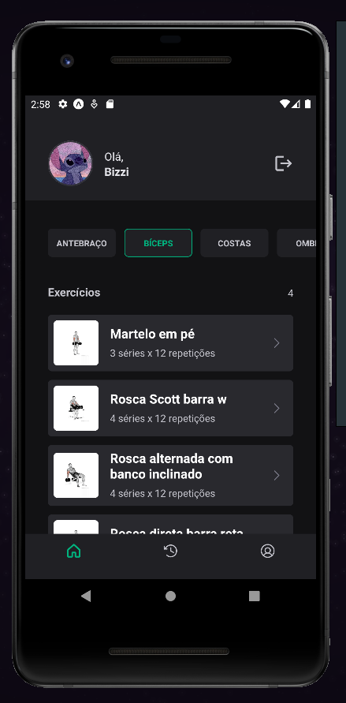
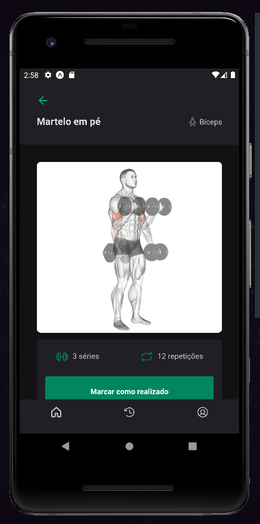
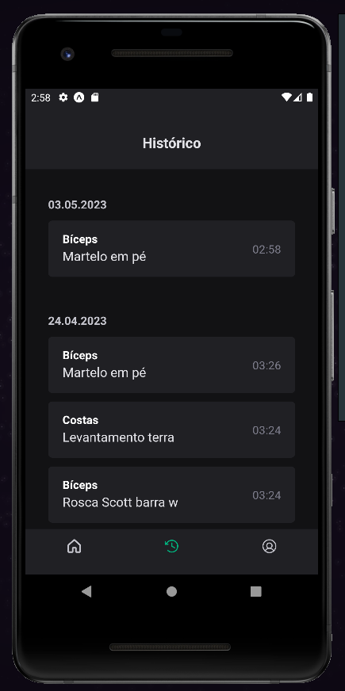
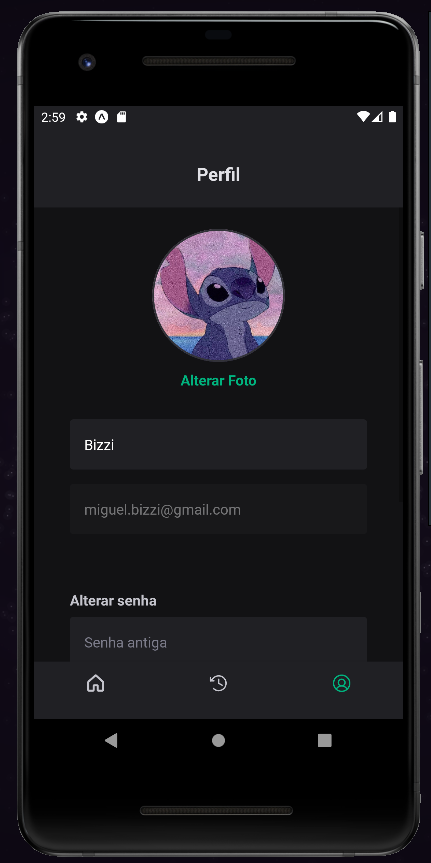

# ignitegym
Um aplicativo de academia desenvolvido com base no curso da Rocketseat. Com React-Native juntamente da biblioteca native-base para a construção de sua interface gráfica, que oferece recursos de design atraente e de fácil utilização. Além disso, você utiliza a Context API para gerenciamento de estado da aplicação, garantindo que as informações sejam compartilhadas entre os componentes de forma eficiente e organizada.

O aplicativo consome dados de uma API fornecida pelo back-end da plataforma, possibilitando o acesso às informações dos usuários e das atividades oferecidas pela academia, utilização de refresh token e de um banco de dados. Com isso, é possível visualizar informações sobre as aulas, marcar as atividades como concluida, acompanhar o histórico de exercicios, personalização de seu proprio perfil e alteração de dados.

Seu projeto de academia na plataforma Github é uma excelente iniciativa para incentivar a prática de exercícios físicos e promover hábitos saudáveis para seus usuários. Com a utilização de tecnologias modernas e recursos avançados, o aplicativo oferece uma experiência completa e eficiente para seus usuários, tornando-se uma excelente opção para quem busca melhorar sua saúde e qualidade de vida.

Com esse projeto consegui evoluir e aprender novos conhecimentos

## Tecnologias

Esse projeto foi desenvolvido com as seguintes tecnologias:

- React Native
- Expo
- Native Base
- Typescript

## Screenshots

  Login
  
  
  
  Tela de inicio
  
  
  
  Detalhes do exercicio
  
  
  
  Historico
  
  
  
  Perfil
  
  

